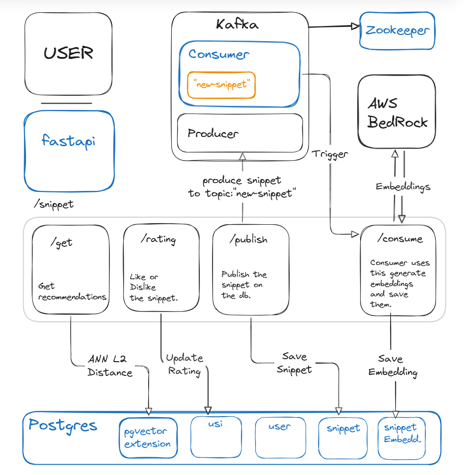

# Snippet Flow :sparkles:
- [Overview](#Overview)
- [Architecture](#architecture)
- [Quick Start](#whale-quick-start)
- [Endpoints](#endpoints)
- [Database Schema](#-database-schema)
- [Troubleshooting](#troubleshooting)
- [Next Steps](#next-steps)

## Overview
Snippet-flow is the personalised book exerpt recommendations system. Users can publish their favorite book exerpt or quotes and get the recommemdations based on the liked snippets. It Uses ...
1. PostgreSQL to manage relational data between users, snippets, their interactions, and embedding tables.
2. pgvector extension to store vector embeddings in PostgreSQL and perform approximate nearest neighbor searches using L2 distance metrics.
3. AWS Bedrock to generate high-quality vector embeddings from text content.
4. Apache Kafka for event-driven architecture, enabling real-time user experiences. A dedicated consumer service continuously monitors the "new-snippet" topic, generates embeddings, and persists them to PostgreSQL via the '/consume' endpoint. Endpoint is used as the consumer is running as the separate service.
5. Docker for containerized microservices architecture, including FastAPI, Kafka, Kafka Consumer, ZooKeeper, and PostgreSQL services.

## Architecture
Boxes in blue are microservices running on Docker.



## :whale: Quick Start
```bash
git clone <repo-name>
docker compose up # Sit back, relax and cross your fingers. Everything should work without errors.
```
## Endpoints
#### POST `/snippet/publish`
Publishes a new snippet
```json
{
  "text": "To be or not to be, that is the question",
  "author": "William Shakespeare"
}
```
#### POST `/snippet/rating`
Rates an existing snppet
```json
{
    "user_id" : 1,
    "snippet_id" : 1,
    "rating" : 1 // 1->like, -1->dislike
}
```
#### POST `/snippet/get`
Get 10 personalised quote recommedations 
```json
{
    "user_id" : 1,
    "email" : "@example.com"
}
```
#### POST `/snippet/consume`
For consumer to consume.
```bash
# this endpoint is for the consumer, consumer calls this endpoint to generate embeddings and save them in pgvector.
```

## 💾 Database Schema

### Tables
- `snippet` - Stores text content and metadata
- `user` - User information
- `snippet_embedding` - Vector embeddings of snippets, Foreign Key: snippet_id
- `usi` - User-Snippet Interactions (ratings). Foreign Keys: snippet_id, user_id.

### Key Relationships
- Each snippet can have one embedding
- Users can have many interactions with snippets
- Snippets can be rated by many users
---

## Environment Variables
```bash
# Don't you worry, its all there in docker-compose.yml
```

## ⚠️ Troubleshooting
### Common Issues
- **pgvector extension missing**: Run `CREATE EXTENSION vector;` in your PostgreSQL database using the commands.
```bash
# postgres service must be running.
docker exec -it postgres bash
psql -U username -d snippet-flow-db
CREATE EXTENSION vector;
\dx # check extension.
```

## Next Steps
1. Replace pgvector with OpenSearch to improve recommendation speed and scalability
2. implement /auth endpoints.
3. Develop a user-friendly frontend interface.
4. Deploy the microservices architecture.
5. Implement Apache Airflow to schedule periodic recommendation and manage producer as independent service.